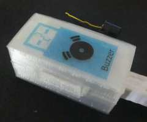
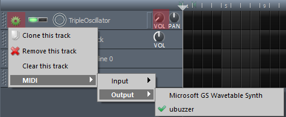
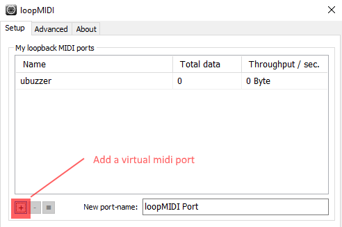
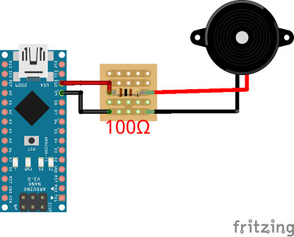

[Français](https://madnerdorg.github.io/buzzer/readme.fr)  

   
[Download Buzzer](https://github.com/madnerdorg/buzzer/archive/master.zip) / [Application](http://madnerd.org/interface/midi)     /   [LibreConnect](https://madnerdorg.github.io/libreconnect/) / [Source](https://github.com/madnerdorg/buzzer) 

  
Play music / Build an alarm using a buzzer.

- [Applications](#applications)
- [Commands](#commands)
- [Build buzzer](#build-buzzer)
- [3D Printing](#3d-printing)

# Applications

## Midi Keyboard

* Plug your **MIDI keyboard**.
* Go to [http://madnerd.org/interface/midi]()

## Midi Software

You can compose music that will be played by the buzzer.    

### LoopMidi 
     
We are going to use loopMidi to generate virtual midi port on Windows.
* Download : [loopMidi](http://www.tobias-erichsen.de/software/loopmidi.html)
* Click on **+** to create a virtual midi port

### LMMS
Examples are available in **lmms/** 
* Download **LMMS** : https://lmms.io/download/#windows
* On **TripleOscillator** put the volume to 0
* Click on the gear next to **TripleOscillator**
* Click on Midi and choose your **virtual midi port** (**Loopmidi by default**) ## 

# Commands
* /info --------> Display name:port    
* X -------> Where X is the frequency in hz
* OFF -------> Stop sound    

# Build buzzer

## Components

* Arduino nano CH340G: 2€    
* 10 Buzzer : 1.80€  (1 Buzzer:0.18€)  
* Resistor pack 400pcs (3€) (1 resistor: 0.0071€) 
* 5 pcs stripboard (1.18€) (1 stripboard : 0.24€ )  
* Total : 7.98€ (2.43€)   

## Wiring
Don't forget to isolate the circuit from the arduino   
### Buzzer only 
   
* Pin 9 : RESISTOR (100Ω) --- Buzzer +   
* Pin 10 : Buzzer -    

### Buzzer/Led
You can add a led (**before the resistor**)
* Pin 9 : RESISTOR (100Ω) --- Led + / Buzzer +   
* Pin 10 : Led - / Buzzer -  

## 3D Printing
This model is a **all purpose case** for arduino nano projects    
Models by Olivier Sarrailh : [https://github.com/madnerdorg/buzzer/tree/master/3D]()    
>This models can be a little too small to fit the circuit

# Licences
## Buzzer.ino
* Author: Rémi Sarrailh (madnerd.org)   
* Licence: MIT

## ToneAC
* Author: Tim Eckel
* Licence : GNU GPL v3
* Link: [https://bitbucket.org/teckel12/arduino-toneac/wiki/Home]()
* Donate : [PayPal](https://bitbucket.org/teckel12/arduino-toneac/wiki/Home#!show-your-appreciation)
